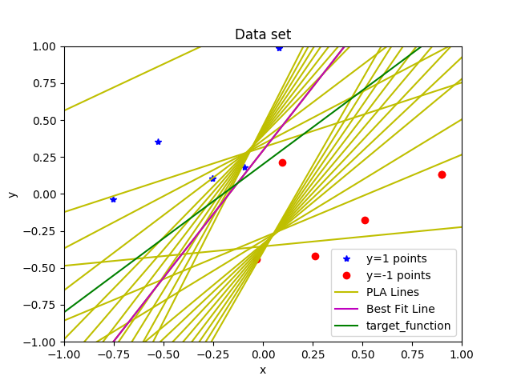
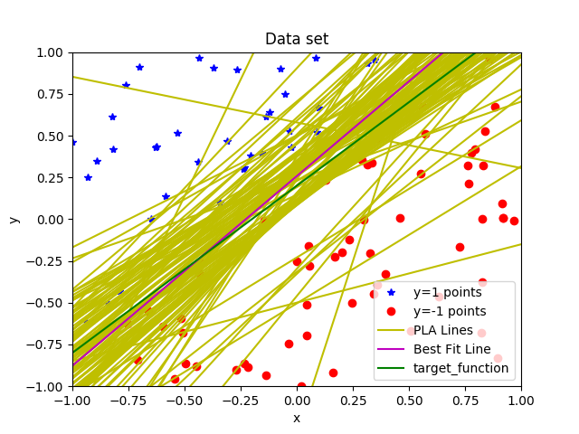

# Perceptron_Algorithm
It includes Implementation of Perceptron Algorithm.

```
Code has following variables which can be changed as follows:
1. N number of random points in data set.
2. Slope of target function.
3. Y-intercept of target function.
```

If we take N=10 we get some graph.

How to run the code.

```
$ git clone https://github.com/harshkakashaniya/Perceptron_Algorithm/
$ cd Perceptron_Algorithm/
$ python3 PLA.py
```

So you get output as follows.

##


## N=10 points.




## N=100 points.


## Team:
Koyal Bhartia     (116350990)

Harsh Kakashaniya (116311236)

## Under Guidance of:
Prof. Nikhil Chopra
